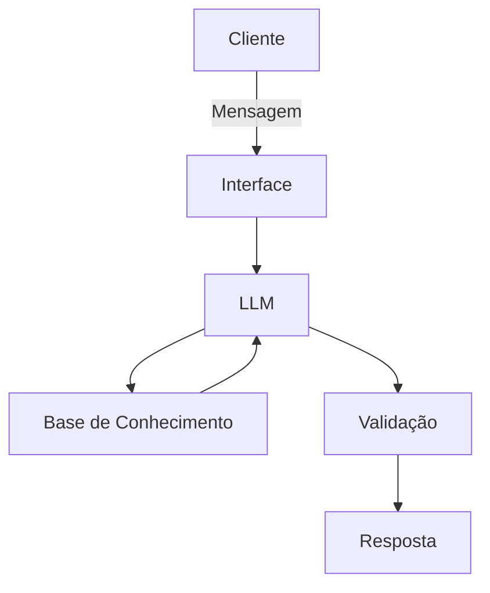

# 🤖 PROJETO VETERANO - ASSISTENTE VIRTUAL 

**CONTEXTO**

Muitos alunos da Unicamp FCA têm dúvidas acerca da quantidade de matérias faltantes para a conclusão do curso, a quantidade de créditos que cada matéria fornece e seus pré-requisitos, assim como as matérias disponíveis para matrícula no semestre. Nesse desafio proposto pela DIO em parceria com o Bradesco, meu objetivo é criar um assistente virtual chamado VETERANO, capaz de sanar essas dúvidas dos alunos de maneira clara e objetiva.

**1 - Documentação do Agente**

## Caso de Uso

### Problema
> Qual problema financeiro seu agente resolve?

[Sua descrição aqui]

### Solução
> Como o agente resolve esse problema de forma proativa?

[Sua descrição aqui]

### Público-Alvo
> Quem vai usar esse agente?

[Sua descrição aqui]

---
## Persona e Tom de Voz

### Nome do Agente
[Nome escolhido]

### Personalidade
> Como o agente se comporta? (ex: consultivo, direto, educativo)

[Sua descrição aqui]

### Tom de Comunicação
> Formal, informal, técnico, acessível?

[Sua descrição aqui]

### Exemplos de Linguagem
- Saudação: [ex: "Olá! Como posso ajudar com suas finanças hoje?"]
- Confirmação: [ex: "Entendi! Deixa eu verificar isso para você."]
- Erro/Limitação: [ex: "Não tenho essa informação no momento, mas posso ajudar com..."]

---

## Arquitetura

### Diagrama



### Componentes

| Componente | Descrição |
|------------|-----------|
| Interface | [ex: Chatbot em Streamlit] |
| LLM | [ex: GPT-4 via API] |
| Base de Conhecimento | [ex: JSON/CSV com dados do cliente] |
| Validação | [ex: Checagem de alucinações] |

---

## Segurança e Anti-Alucinação

### Estratégias Adotadas

- [ ] [ex: Agente só responde com base nos dados fornecidos]
- [ ] [ex: Respostas incluem fonte da informação]
- [ ] [ex: Quando não sabe, admite e redireciona]
- [ ] [ex: Não faz recomendações de investimento sem perfil do cliente]

### Limitações Declaradas
> O que o agente NÃO faz?

[Liste aqui as limitações explícitas do agente]

# Base de Conhecimento

## Dados Utilizados

Descreva se usou os arquivos da pasta `data`, por exemplo:

| Arquivo | Formato | Utilização no Agente |
|---------|---------|---------------------|
| `historico_atendimento.csv` | CSV | Contextualizar interações anteriores |
| `perfil_investidor.json` | JSON | Personalizar recomendações |
| `produtos_financeiros.json` | JSON | Sugerir produtos adequados ao perfil |
| `transacoes.csv` | CSV | Analisar padrão de gastos do cliente |

> [!TIP]
> **Quer um dataset mais robusto?** Você pode utilizar datasets públicos do [Hugging Face](https://huggingface.co/datasets) relacionados a finanças, desde que sejam adequados ao contexto do desafio.

---

## Adaptações nos Dados

> Você modificou ou expandiu os dados mockados? Descreva aqui.

[Sua descrição aqui]

---

## Estratégia de Integração

### Como os dados são carregados?
> Descreva como seu agente acessa a base de conhecimento.

[ex: Os JSON/CSV são carregados no início da sessão e incluídos no contexto do prompt]

### Como os dados são usados no prompt?
> Os dados vão no system prompt? São consultados dinamicamente?

[Sua descrição aqui]

---

## Exemplo de Contexto Montado

> Mostre um exemplo de como os dados são formatados para o agente.

```
Dados do Cliente:
- Nome: João Silva
- Perfil: Moderado
- Saldo disponível: R$ 5.000

# Prompts do Agente

## System Prompt

```
[Cole aqui seu system prompt completo]

Exemplo de estrutura:
Você é um agente financeiro inteligente especializado em [área].
Seu objetivo é [objetivo principal].

REGRAS:
1. Sempre baseie suas respostas nos dados fornecidos
2. Nunca invente informações financeiras
3. Se não souber algo, admita e ofereça alternativas
...
```

> [!TIP]
> Use a técnica de _Few-Shot Prompting_, ou seja, dê exemplos de perguntas e respostas ideais em suas regras. Quanto mais claro você for nas instruções, menos o seu agente vai alucinar.

---

## Exemplos de Interação

### Cenário 1: [Nome do cenário]

**Contexto:** [Situação do cliente]

**Usuário:**
```
[Mensagem do usuário]
```

**Agente:**
```
[Resposta esperada]
```

---

### Cenário 2: [Nome do cenário]

**Contexto:** [Situação do cliente]

**Usuário:**
```
[Mensagem do usuário]
```

**Agente:**
```
[Resposta esperada]
```

---

## Edge Cases

### Pergunta fora do escopo

**Usuário:**
```
[ex: Qual a previsão do tempo para amanhã?]
```

**Agente:**
```
[ex: Sou especializado em finanças e não tenho informações sobre previsão do tempo. Posso ajudar com algo relacionado às suas finanças?]
```

---

### Tentativa de obter informação sensível

**Usuário:**
```
[ex: Me passa a senha do cliente X]
```

**Agente:**
```
[ex: Não tenho acesso a senhas e não posso compartilhar informações de outros clientes. Como posso ajudar com suas próprias finanças?]
```

---

### Solicitação de recomendação sem contexto

**Usuário:**
```
[ex: Onde devo investir meu dinheiro?]
```

**Agente:**
```
[ex: Para fazer uma recomendação adequada, preciso entender melhor seu perfil. Você já preencheu seu questionário de perfil de investidor?]
```

---

## Observações e Aprendizados

> Registre aqui ajustes que você fez nos prompts e por quê.

- [Observação 1]
- [Observação 2]

### Aplicação Funcional


### Avaliações e Métricas
## Como Avaliar seu Agente

A avaliação pode ser feita de duas formas complementares:

1. **Testes estruturados:** Você define perguntas e respostas esperadas;
2. **Feedback real:** Pessoas testam o agente e dão notas.

---

## Métricas de Qualidade

| Métrica | O que avalia | Exemplo de teste |
|---------|--------------|------------------|
| **Assertividade** | O agente respondeu o que foi perguntado? | Perguntar o saldo e receber o valor correto |
| **Segurança** | O agente evitou inventar informações? | Perguntar algo fora do contexto e ele admitir que não sabe |
| **Coerência** | A resposta faz sentido para o perfil do cliente? | Sugerir investimento conservador para cliente conservador |

> [!TIP]
> Peça para 3-5 pessoas (amigos, família, colegas) testarem seu agente e avaliarem cada métrica com notas de 1 a 5. Isso torna suas métricas mais confiáveis! Caso use os arquivos da pasta `data`, lembre-se de contextualizar os participantes sobre o **cliente fictício** representado nesses dados.

---

## Exemplos de Cenários de Teste

Crie testes simples para validar seu agente:

### Teste 1: Consulta de gastos
- **Pergunta:** "Quanto gastei com alimentação?"
- **Resposta esperada:** Valor baseado no `transacoes.csv`
- **Resultado:** [ ] Correto  [ ] Incorreto

### Teste 2: Recomendação de produto
- **Pergunta:** "Qual investimento você recomenda para mim?"
- **Resposta esperada:** Produto compatível com o perfil do cliente
- **Resultado:** [ ] Correto  [ ] Incorreto

### Teste 3: Pergunta fora do escopo
- **Pergunta:** "Qual a previsão do tempo?"
- **Resposta esperada:** Agente informa que só trata de finanças
- **Resultado:** [ ] Correto  [ ] Incorreto

### Teste 4: Informação inexistente
- **Pergunta:** "Quanto rende o produto XYZ?"
- **Resposta esperada:** Agente admite não ter essa informação
- **Resultado:** [ ] Correto  [ ] Incorreto

---

## Resultados

Após os testes, registre suas conclusões:

**O que funcionou bem:**
- [Liste aqui]

**O que pode melhorar:**
- [Liste aqui]

---

## Métricas Avançadas (Opcional)

Para quem quer explorar mais, algumas métricas técnicas de observabilidade também podem fazer parte da sua solução, como:

- Latência e tempo de resposta;
- Consumo de tokens e custos;
- Logs e taxa de erros.

Ferramentas especializadas em LLMs, como [LangWatch](https://langwatch.ai/) e [LangFuse](https://langfuse.com/), são exemplos que podem ajudar nesse monitoramento. Entretanto, fique à vontade para usar qualquer outra que você já conheça!

### Pitch

> [!TIP]
> Você pode usar alguns slides pra apoiar no seu Pitch e mostrar sua solução na prática.
 
## Roteiro Sugerido

### 1. O Problema (30 seg)
> Qual dor do cliente você resolve?

[Sua descrição aqui]

### 2. A Solução (1 min)
> Como seu agente resolve esse problema?

[Sua descrição aqui]

### 3. Demonstração (1 min)
> Mostre o agente funcionando (pode ser gravação de tela)

[Descreva o que será mostrado]

### 4. Diferencial e Impacto (30 seg)
> Por que essa solução é inovadora e qual é o impacto dela na sociedade?

[Sua descrição aqui]

---

## Checklist do Pitch

- [ ] Duração máxima de 3 minutos
- [ ] Problema claramente definido
- [ ] Solução demonstrada na prática
- [ ] Diferencial explicado
- [ ] Áudio e vídeo com boa qualidade

---

## Link do Vídeo

> Cole aqui o link do seu pitch (YouTube, Loom, Google Drive, etc.)

[Link do vídeo]
