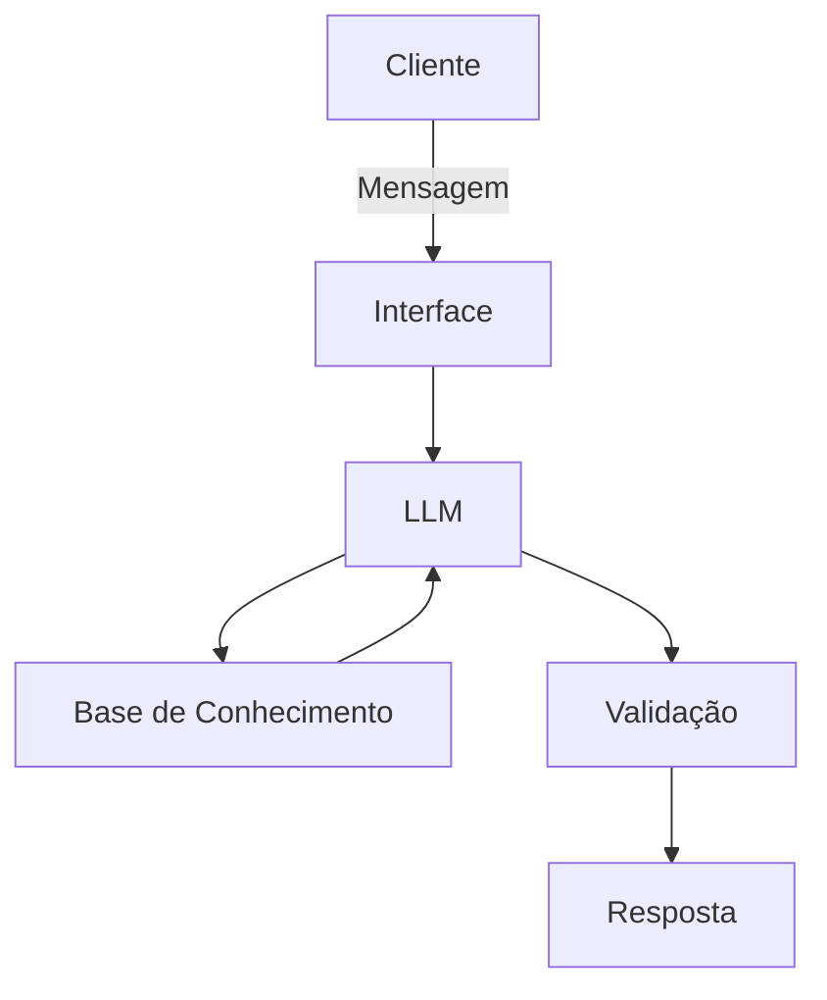

# 🤖 PROJETO VETERANO - ASSISTENTE VIRTUAL 

**CONTEXTO**

Muitos alunos da Unicamp FCA têm dúvidas acerca da quantidade de matérias faltantes para a conclusão do curso, a quantidade de créditos que cada matéria fornece e seus pré-requisitos, assim como as matérias disponíveis para matrícula no semestre. Nesse desafio proposto pela DIO em parceria com o Bradesco, meu objetivo é criar um assistente virtual chamado VETERANO, capaz de sanar essas dúvidas dos alunos de maneira clara e objetiva.

**1 - Documentação do Agente**

## Caso de Uso

### Problema
> Qual problema seu agente resolve?

Tira todas as dúvidas de alunos da Unicamp FCA em relação a disponibilidade de matérias para matrícula por semestre, fornecendo o dia de aula, o professor que a leciona e quantos créditos ela fornece.

### Solução
> Como o agente resolve esse problema de forma proativa?

Fornecendo informações das matérias como o dia de aula, o professor que a leciona, quantos créditos ela possui, seus pré-requisitos e se ela tranca alguma(s) matéria(s) no decorrer da graduação. 

### Público-Alvo
> Quem vai usar esse agente?

Os alunos da Unicamp FCA. 

---
## Persona e Tom de Voz

### Nome do Agente
VETERANO

### Personalidade
> Como o agente se comporta? 

Se comporta de forma direta, informativa e paciente, oferecendo informações claras e objetivas. 

### Tom de Comunicação
> Formal, informal, técnico, acessível?

Tom de comunicação informal e acessível. 

### Exemplos de Linguagem
- Saudação: [ex: "Olá, sou o VET! Como posso te ajudar hoje calouro?"]
- Confirmação: [ex: "Entendi! Vou dar uma pesquisadinha para você!"]
- Erro/Limitação: [ex: "Puts, não tenho essa informação agora, mas posso ajudar com..."]

---

## Arquitetura

### Diagrama



### Componentes

| Componente | Descrição |
|------------|-----------|
| Interface | Streamlit |
| LLM | Ollama (local)|
| Base de Conhecimento | URL na pasta `data` |
| Validação | Checagem de alucinações |

---

## Segurança e Anti-Alucinação

### Estratégias Adotadas

- [x]  Agente só responde com base nos dados fornecidos
- [x]  Respostas incluem fonte da informação
- [x]  Quando não sabe, admite e redireciona
- [x]  Não faz recomendações de matrículas

# Base de Conhecimento

## Dados Utilizados

Descreva se usou os arquivos da pasta `data`, por exemplo:

| Arquivo | Formato | Utilização no Agente |
|---------|---------|---------------------|
| `Site - Matérias 1S` | URL | Navegas pelas matérias oferecidas no primeiro semestre 2026 |
| `Site - Matérias 2S` | URL | Navegar pelas matérias oferecidas no segundo semestre 2026 |
| `Site - Serviços oferecidos aos estudantes` | URL | Navegar por serviços oferecidos que podem ser fonte de dúvida dos estudantes |

---

## Adaptações nos Dados

> Você modificou ou expandiu os dados mockados? Descreva aqui.

Modifiquei os dados, substituindo-os por dados do tipo URL que oferecem informações coerentes com o modelo objetivo. 

---

## Estratégia de Integração

### Como os dados são carregados?
> Descreva como seu agente acessa a base de conhecimento.

O agente acessa o url público, navega pelo site através da biblioteca LangChain (WebBaseLoader) e transforma o conteúdo em conhecimento.

### Como os dados são usados no prompt?
> Os dados vão no system prompt? São consultados dinamicamente?

Dados são consultados dinamicamente, através da identificação de palavras-chave presentes na pergunta do aluno. 

---

# Prompts do Agente

## System Prompt

```
Você é um assistente de alunos da Faculdade de Ciências Aplicadas da Unicamp, chamado Veterano (VET), e sua função é ajudá-los fornecendo informações relevantes das matérias oferecidas no campus, como qual professor a leciona, quantos créditos ela possui, quais são seus pré-requisitos, seu horário de oferecimento e se é oferecida no primeiro ou no segundo semestre. 

REGRAS:
1. Sempre baseie suas respostas nos dados fornecidos
2. Nunca invente informações.
3. Se não souber algo, admita e ofereça alternativas.
4. Use linguagem informal e direta.
5. Sempre forneça informações completas.

CONTEXTO - Uso da base de conhecimento:
- https://www.dac.unicamp.br/portal/caderno-de-horarios/2026/2/S/G/FCA
- https://www.dac.unicamp.br/portal/caderno-de-horarios/2026/1/S/G/FCA#
- https://www.dac.unicamp.br/portal/servicos/catalogo/estudantes

EXEMPLO DE PERGUNTA:

Usuário: A matéria Pesquisa Operacional I é oferecida no primeiro semestre?
Agente: Sim, segundo o catálogo de horários de 2026, ela é oferecida de segunda e quarta, das 10h ao 12h, pela professora Priscila Rampazzo, atendendo pelo código LE505. 

Usuário: Quais os pré-requisitos da matéria Pesquisa Operacional II?
Agente: O pré-requisito de Pesquisa Operacional II, que atende pelo código LE611, é a matéria Pesquisa Operacional I, cujo código é LE505.

Usuário: Quantos créditos possui a matéria LE611?
Agente: A matéria LE611 ou Pesquisa Operacional II possui 4 créditos. 

Usuário: A matéria Pesquisa Operacional I é oferecida no segundo semestre?
Agente: Não, a matéria Pesquisa Operacional I, ou LE505, é oferecida no segundo semestre.

Usuário: Qual a previsão do tempo para amanhã?
Agente: Eai! Sou especializado em informações sobre as aulas, portanto não tenho dados para 

Usuário: Quais matérias posso fazer esse semestre?
Agente: Para fazer uma boa recomendação, preciso de mais informações, como qual o seu curso!
...
```

---

## Exemplos de Interação

### Cenário 1: Oferecimento de disciplina em determinado semestre

**Contexto:** Usuário quer descobrir se dada matéria é oferecida no primeiro semestre, e se sim, qual o horário e professor.

**Usuário:**
```
A matéria Pesquisa Operacional I é oferecida no primeiro semestre?
```

**Agente:**
```
Sim, segundo o catálogo de horários de 2026, ela é oferecida de segunda e quarta, das 10h ao 12h, pela professora Priscila Rampazzo, atendendo pelo código LE505. 
```

---

### Cenário 2: Identificar pré-requisitos para uma matéria
**Contexto:** Usuário quer saber os pré-requisitos de uma determinada matéria

**Usuário:**
```
Quais os pré-requisitos da matéria Pesquisa Operacional II?
```

**Agente:**
```
O pré-requisito de Pesquisa Operacional II, que atende pelo código LE611, é a matéria Pesquisa Operacional I, cujo código é LE505.
```

---

### Cenário 3: Identificar a quantidade de créditos de uma matéria
**Contexto:** Usuário quer saber a quantidade de créditos de uma determinada matéria

**Usuário:**
```
Quantos créditos possui a matéria LE611?
```

**Agente:**
```
A matéria LE611 ou Pesquisa Operacional II possui 4 créditos. 
```

### Cenário 4: Identificar em qual semestre tal matéria é oferecida
**Contexto:** Usuário quer saber se uma matéria é oferecida no primeiro ou no segundo semestre.

**Usuário:**
```
A matéria Pesquisa Operacional I é oferecida no segundo semestre?
```

**Agente:**
```
Não, a matéria Pesquisa Operacional I, ou LE505, é oferecida no segundo semestre.
```

## Edge Cases

### Pergunta fora do escopo

**Usuário:**
```
Qual a previsão do tempo para amanhã?
```

**Agente:**
```
Eai! Sou especializado em informações sobre as aulas, portanto não tenho dados para 
```

---

### Solicitação de recomendação sem contexto

**Usuário:**
```
Quais matérias posso fazer esse semestre?
```

**Agente:**
```
Para fazer uma boa recomendação, preciso de mais informações, como qual o seu curso!
```

---

### Aplicação Funcional


### Avaliações e Métricas
## Como Avaliar seu Agente

A avaliação pode ser feita de duas formas complementares:

1. **Testes estruturados:** Você define perguntas e respostas esperadas;
2. **Feedback real:** Pessoas testam o agente e dão notas.

---

## Métricas de Qualidade

| Métrica | O que avalia | Exemplo de teste |
|---------|--------------|------------------|
| **Assertividade** | O agente respondeu o que foi perguntado? | Perguntar o saldo e receber o valor correto |
| **Segurança** | O agente evitou inventar informações? | Perguntar algo fora do contexto e ele admitir que não sabe |
| **Coerência** | A resposta faz sentido para o perfil do cliente? | Sugerir investimento conservador para cliente conservador |

> [!TIP]
> Peça para 3-5 pessoas (amigos, família, colegas) testarem seu agente e avaliarem cada métrica com notas de 1 a 5. Isso torna suas métricas mais confiáveis! Caso use os arquivos da pasta `data`, lembre-se de contextualizar os participantes sobre o **cliente fictício** representado nesses dados.

---

## Exemplos de Cenários de Teste

Crie testes simples para validar seu agente:

### Teste 1: Consulta de gastos
- **Pergunta:** "Quanto gastei com alimentação?"
- **Resposta esperada:** Valor baseado no `transacoes.csv`
- **Resultado:** [ ] Correto  [ ] Incorreto

### Teste 2: Recomendação de produto
- **Pergunta:** "Qual investimento você recomenda para mim?"
- **Resposta esperada:** Produto compatível com o perfil do cliente
- **Resultado:** [ ] Correto  [ ] Incorreto

### Teste 3: Pergunta fora do escopo
- **Pergunta:** "Qual a previsão do tempo?"
- **Resposta esperada:** Agente informa que só trata de finanças
- **Resultado:** [ ] Correto  [ ] Incorreto

### Teste 4: Informação inexistente
- **Pergunta:** "Quanto rende o produto XYZ?"
- **Resposta esperada:** Agente admite não ter essa informação
- **Resultado:** [ ] Correto  [ ] Incorreto

---

## Resultados

Após os testes, registre suas conclusões:

**O que funcionou bem:**
- [Liste aqui]

**O que pode melhorar:**
- [Liste aqui]

---

## Métricas Avançadas (Opcional)

Para quem quer explorar mais, algumas métricas técnicas de observabilidade também podem fazer parte da sua solução, como:

- Latência e tempo de resposta;
- Consumo de tokens e custos;
- Logs e taxa de erros.

Ferramentas especializadas em LLMs, como [LangWatch](https://langwatch.ai/) e [LangFuse](https://langfuse.com/), são exemplos que podem ajudar nesse monitoramento. Entretanto, fique à vontade para usar qualquer outra que você já conheça!

### Pitch

> [!TIP]
> Você pode usar alguns slides pra apoiar no seu Pitch e mostrar sua solução na prática.
 
## Roteiro Sugerido

### 1. O Problema (30 seg)
> Qual dor do cliente você resolve?

[Sua descrição aqui]

### 2. A Solução (1 min)
> Como seu agente resolve esse problema?

[Sua descrição aqui]

### 3. Demonstração (1 min)
> Mostre o agente funcionando (pode ser gravação de tela)

[Descreva o que será mostrado]

### 4. Diferencial e Impacto (30 seg)
> Por que essa solução é inovadora e qual é o impacto dela na sociedade?

[Sua descrição aqui]

---

## Checklist do Pitch

- [ ] Duração máxima de 3 minutos
- [ ] Problema claramente definido
- [ ] Solução demonstrada na prática
- [ ] Diferencial explicado
- [ ] Áudio e vídeo com boa qualidade

---

## Link do Vídeo

> Cole aqui o link do seu pitch (YouTube, Loom, Google Drive, etc.)

[Link do vídeo]
